    

    <b>Automatic Architecture Diagrams from Code</b> 
    <a href="https://github.com/swark-io/swark">GitHub</a> • <a href="https://swark.io">Website</a> • <a href="mailto:contact@swark.io">Contact Us</a>

## Usage Instructions

1. **Render the Diagram**: Use the links below to open it in Mermaid Live Editor, or install the [Mermaid Support](https://marketplace.visualstudio.com/items?itemName=bierner.markdown-mermaid) extension.
2. **Recommended Model**: If available for you, use `claude-3.5-sonnet` [language model](vscode://settings/swark.languageModel). It can process more files and generates better diagrams.
3. **Iterate for Best Results**: Language models are non-deterministic. Generate the diagram multiple times and choose the best result.

## Generated Content
**Model**: GPT-4o - [Change Model](vscode://settings/swark.languageModel)  
**Mermaid Live Editor**: [View](https://mermaid.live/view#pako:eNp1ls1uozAQx18FcW5fIIeVSNJtK7XdqEmlPeQy2FOwajyWbZJ0q777miQFQsY3-P88zDfwlQuSmM_yrakc2DrbLLcmy3xbnm4X1FgyaILv5BF4ezwJWbYh0kHZ7Pb2V_bmcUPgA8c2VFUa0-TeUWt5HJ-IjkV4COAQWAalT-ipMBKRr_cqiJolZAwf2VormSAfqDGQYVk0KoE3qxH56NCCg0C8VfQleDPhSOsiUbxX9OpfqlCvIBUl27VyVDn0bO1XZGnHl2UFlTIQFF-YF9ip6kif0bTciU5PlO4JStQceDS2DUnwJ7D5PXQZLMBJDv4m13D60pGVtE9Gv1SgqeLIgkyIU54yjAvagJE80hqsV4kuLmoUHyUdeAaOLUzMm1rPV3PpYM_3NlWtBWg0km_avA2JJZnHmZXCtU3JUpAVm2-xg8C7KryNS_LajReLNfLFOIJ05wohyMl-oPGnS6u21Eoch9lPynOFxlW4gmdnCXp3iC9NA_pJmY_EkWLfe44L1h087Te10fSs9Pi8f1dhTdAwqBPw96Q-oKOrZ_TiMyg9kVZ1_ABNtMI52i_jPp30u4ONnVAeJ-W81OcOFGsw7x1c6g_Yb8EliJ855zlQiKB2KnxybB0w1OQF2bEzhUawYY_BeEsm8Bns6iKrAc3j9bsAf3bXvUhAhImvsTruyFgfmjJWR325PDwENNa7WULJkXW_GUUZJ28S4KCNpnUQJ0kO4N6BbI_TtwA7hX1nj67zm7xB14CS8Ufoa5uHGhvc5rNsm0t8h1aHbf4dD7VWQsC48PEXqMlnwbV4k0MbaP1pxM99fD9WdT57B-3x-z8_XeJ8) | [Edit](https://mermaid.live/edit#pako:eNp1ls1uozAQx18FcW5fIIeVSNJtK7XdqEmlPeQy2FOwajyWbZJ0q777miQFQsY3-P88zDfwlQuSmM_yrakc2DrbLLcmy3xbnm4X1FgyaILv5BF4ezwJWbYh0kHZ7Pb2V_bmcUPgA8c2VFUa0-TeUWt5HJ-IjkV4COAQWAalT-ipMBKRr_cqiJolZAwf2VormSAfqDGQYVk0KoE3qxH56NCCg0C8VfQleDPhSOsiUbxX9OpfqlCvIBUl27VyVDn0bO1XZGnHl2UFlTIQFF-YF9ip6kif0bTciU5PlO4JStQceDS2DUnwJ7D5PXQZLMBJDv4m13D60pGVtE9Gv1SgqeLIgkyIU54yjAvagJE80hqsV4kuLmoUHyUdeAaOLUzMm1rPV3PpYM_3NlWtBWg0km_avA2JJZnHmZXCtU3JUpAVm2-xg8C7KryNS_LajReLNfLFOIJ05wohyMl-oPGnS6u21Eoch9lPynOFxlW4gmdnCXp3iC9NA_pJmY_EkWLfe44L1h087Te10fSs9Pi8f1dhTdAwqBPw96Q-oKOrZ_TiMyg9kVZ1_ABNtMI52i_jPp30u4ONnVAeJ-W81OcOFGsw7x1c6g_Yb8EliJ855zlQiKB2KnxybB0w1OQF2bEzhUawYY_BeEsm8Bns6iKrAc3j9bsAf3bXvUhAhImvsTruyFgfmjJWR325PDwENNa7WULJkXW_GUUZJ28S4KCNpnUQJ0kO4N6BbI_TtwA7hX1nj67zm7xB14CS8Ufoa5uHGhvc5rNsm0t8h1aHbf4dD7VWQsC48PEXqMlnwbV4k0MbaP1pxM99fD9WdT57B-3x-z8_XeJ8)

```mermaid
graph TD
  subgraph Components
    subgraph UI
      Tooltip --> UseToast
      Tooltip --> Toggle
      Tooltip --> ToggleGroup
      Tooltip --> Toaster
      Tooltip --> Textarea
      Tooltip --> Tabs
      Tooltip --> Table
      Tooltip --> Toast
      Tooltip --> Switch
      Tooltip --> Sonner
      Tooltip --> Slider
      Tooltip --> Skeleton
      Tooltip --> Sidebar
      Tooltip --> Sheet
      Tooltip --> Separator
      Tooltip --> Select
      Tooltip --> ScrollArea
      Tooltip --> Resizable
      Tooltip --> RadioGroup
      Tooltip --> Progress
      Tooltip --> Popover
      Tooltip --> Pagination
      Tooltip --> NavigationMenu
      Tooltip --> Menubar
      Tooltip --> Label
      Tooltip --> Input
      Tooltip --> InputOtp
      Tooltip --> HoverCard
      Tooltip --> Form
      Tooltip --> DropdownMenu
      Tooltip --> Dialog
      Tooltip --> ContextMenu
      Tooltip --> Command
      Tooltip --> Collapsible
      Tooltip --> Checkbox
      Tooltip --> Chart
      Tooltip --> Carousel
      Tooltip --> Drawer
      Tooltip --> Card
      Tooltip --> Calendar
      Tooltip --> Button
      Tooltip --> Breadcrumb
      Tooltip --> Badge
      Tooltip --> Avatar
      Tooltip --> AspectRatio
      Tooltip --> Alert
      Tooltip --> AlertDialog
      Tooltip --> Accordion
    end
    Publications --> Card
    Publications --> Button
    Publications --> Tooltip
    Publications --> ExternalLink
    Publications --> Award
    NavLink --> RouterNavLink
    Navigation --> Button
    Navigation --> Menu
    Navigation --> X
    Hero --> Button
    Hero --> Mail
    Hero --> Phone
    Hero --> ArrowDown
    Expertise --> Card
    Expertise --> Brain
    Expertise --> Bone
    Expertise --> Heart
    Expertise --> Users
    Expertise --> Activity
    Expertise --> Stethoscope
    Experience --> Card
    Experience --> Calendar
    Experience --> MapPin
    Experience --> Briefcase
    Contact --> Card
    Contact --> Button
    Contact --> Mail
    Contact --> Phone
    Contact --> MapPin
    Contact --> Linkedin
    Contact --> Send
    About --> Card
    About --> Award
    About --> Briefcase
    About --> GraduationCap
    About --> Heart
  end
```

