    

    <b>Automatic Architecture Diagrams from Code</b> 
    <a href="https://github.com/swark-io/swark">GitHub</a> • <a href="https://swark.io">Website</a> • <a href="mailto:contact@swark.io">Contact Us</a>

## Usage Instructions

1. **Render the Diagram**: Use the links below to open it in Mermaid Live Editor, or install the [Mermaid Support](https://marketplace.visualstudio.com/items?itemName=bierner.markdown-mermaid) extension.
2. **Recommended Model**: If available for you, use `claude-3.5-sonnet` [language model](vscode://settings/swark.languageModel). It can process more files and generates better diagrams.
3. **Iterate for Best Results**: Language models are non-deterministic. Generate the diagram multiple times and choose the best result.

## Generated Content
**Model**: GPT-4o - [Change Model](vscode://settings/swark.languageModel)  
**Mermaid Live Editor**: [View](https://mermaid.live/view#pako:eNqFVcFymzAQ_RVGp3Ymtm-d1ofOxNCkncatHdxchA8C1lgJSFQSTjJJ_j0L2IAMtDoIrfbt7tvVSryQSMZA5iQQiWL53tl4gXBw6CKsN26ZiGX2q8hCUNcgQDEj1WWe17By1Ahaf6b587ZWgYgDcebsKmX64XZx6VoOUKAsz1vTcngL-mEltUkU-Osbx2OGhUzDx61l50wmX19dKQRERjtGvqLdePifXIDhkcvEgWmLQstQSWEqW6czlowLmuE0Nfppa-vQjyuzXAoQhqIwAGn0mrbLM8yKJaBpNW_7wcs8rUjjHCpoG-Y_wCpgi7Eyb4qCBd7xxPa0YTx95CKm5riYRhVq2svsjhugB5xGEeU5u75Pc_xGWp9w9-e4b_4NxyKDTvEziLL4n87yWJE2h6He8HPFRbKQ0niQSas5WlXVBz1kyiNmuBTTe3Zg2yG7DWg8-1HDSt21HiK4XPu4DfbdW64rSsu_je4ffEoP6sAjoM2qD8E6GSXTFBTtCufAPz86wK4w6BErT0uqArtNucdzO8etlMx1HbS8zphAuQPKcNB9tLf5XboErdEnCn1Ec2-abEe0LflBQDe74UqNRelajjM5brVkrLt22jmqqyKNN8md7-J7brXIlVQPNMSm0wYhkx2K9p255uZ7EdKEm30RzmKuzezTl882xudZnsJCyUeN560raRLW4iyDmLMZPgHw1FpV7MgFyUDhwxnjL-YlIGYPGQRk7gQkhh0rUhOQNwQVecwMeJxhFhmZG1XABWGFkf6ziE6ykkWyJ_MdSzW8vQN2Th3m) | [Edit](https://mermaid.live/edit#pako:eNqFVcFymzAQ_RVGp3Ymtm-d1ofOxNCkncatHdxchA8C1lgJSFQSTjJJ_j0L2IAMtDoIrfbt7tvVSryQSMZA5iQQiWL53tl4gXBw6CKsN26ZiGX2q8hCUNcgQDEj1WWe17By1Ahaf6b587ZWgYgDcebsKmX64XZx6VoOUKAsz1vTcngL-mEltUkU-Osbx2OGhUzDx61l50wmX19dKQRERjtGvqLdePifXIDhkcvEgWmLQstQSWEqW6czlowLmuE0Nfppa-vQjyuzXAoQhqIwAGn0mrbLM8yKJaBpNW_7wcs8rUjjHCpoG-Y_wCpgi7Eyb4qCBd7xxPa0YTx95CKm5riYRhVq2svsjhugB5xGEeU5u75Pc_xGWp9w9-e4b_4NxyKDTvEziLL4n87yWJE2h6He8HPFRbKQ0niQSas5WlXVBz1kyiNmuBTTe3Zg2yG7DWg8-1HDSt21HiK4XPu4DfbdW64rSsu_je4ffEoP6sAjoM2qD8E6GSXTFBTtCufAPz86wK4w6BErT0uqArtNucdzO8etlMx1HbS8zphAuQPKcNB9tLf5XboErdEnCn1Ec2-abEe0LflBQDe74UqNRelajjM5brVkrLt22jmqqyKNN8md7-J7brXIlVQPNMSm0wYhkx2K9p255uZ7EdKEm30RzmKuzezTl882xudZnsJCyUeN560raRLW4iyDmLMZPgHw1FpV7MgFyUDhwxnjL-YlIGYPGQRk7gQkhh0rUhOQNwQVecwMeJxhFhmZG1XABWGFkf6ziE6ykkWyJ_MdSzW8vQN2Th3m)

```mermaid
graph TD
    subgraph RandomNumberGeneratorApp
        Random[Random.py]
    end

    subgraph FlaskRBACApp
        App[app.py]
        DB[(PostgreSQL Database)]
        App -->|Connects to| DB
    end

    subgraph KineticCanvasApp
        subgraph Frontend
            Main[main.tsx]
            AppComponent[App.tsx]
            Components[Components]
            Pages[Pages]
            Main --> AppComponent
            AppComponent --> Components
            AppComponent --> Pages
        end
        subgraph Config
            Tailwind[tailwind.config.ts]
            Vite[vite.config.ts]
            PostCSS[postcss.config.js]
            ESLint[eslint.config.js]
        end
        Frontend --> Config
    end

    subgraph SpringBootDemoApp
        SpringBootMain[SpringBootDemoApplication.java]
        SpringBootTests[SpringBootDemoApplicationTests.java]
    end

    subgraph MQSenderApp
        MQMain[MqSenderAppApplication.java]
        MQService[MQService.java]
        MQController[MQController.java]
        UIController[UIController.java]
        MQConfig[MQManagerConfig.java]
        MQProps[MQConnectionProperties.java]
        MQDTO[MQMessageDTO.java]
        MQMain --> MQService
        MQMain --> MQController
        MQMain --> UIController
        MQController --> MQService
        UIController --> MQService
        MQService --> MQConfig
        MQConfig --> MQProps
    end

    subgraph VSCodeApp
        Fork[bootstrap-fork.js]
        GitHub[github/dist/698.js]
        SimpleBrowser[simple-browser/media/index.js]
    end
```

